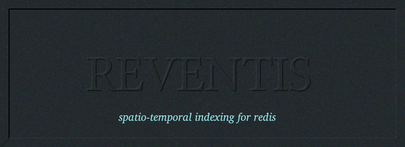

A Redis module for indexing events by location and time for fast efficient
range queries.  Spatial coordinates are given in longitude and latitude with
up to 6 digits of precision. Time is specified by strings - e.g. HH:MM[:SS]
The seconds precision is optional.

## Features

* Store all events in a single Redis native data structure. Use multiple
  data structures with different keys.  

* Efficient range query.  Get all results within a specified range.

* Add/remove categories to individual events.  Include only results
  in a range query that fall in certain specified categories.  Filter
  results by categories of events.

* Purge all that events that fall before a specific time stamp.

* Delete a block of events in a certain range.

* Simple Object tracking feature. Group events by a common object id.
  Track objects by fast efficient access to object histories.  

* Easy to setup and use.  Use any number of language bindings to submit
  commands to the redis server.  Reventis uses a single index to manage
  data.  

## Installation Instructions

To build and install the module:   

```
make .
make all
make install
```

Run `make test` when you have a redis server up and running.  

Installs to /var/local/lib directory.

To load the module into redis, just type in the redis-cli:

```
module load /var/local/lib/reventis.so
module unload reventis
module list

```

Or, put this in your redis.conf configuration file:

```
loadmodule /var/local/lib/reventis.so
```

The latter option is preferable, since it is impossible to simply unload
the module once data is inserted into the database. 


## Module Commands

The following commands are available to interact with the index.  All mostly self-explanatory.
Insert new events with `reventis.insert`  which will reply with a unique event id assigned
for that event.  Using that event id, events can be quickly referenced with the `reventis.lookup`
command or deleted with `reventis.del` command.  `reventis.purge` allows you to delete all events
before the given timestamp.  Or delete a block of events with a given range with `reventis.delblk`.  

```
reventis.insert key longitude latitude date-start time-start date-end time-end title-string
reventis.query key  <longitude range> <latitude range> <time-range>
reventis.lookup key event-id
reventis.delete key event-id
reventis.purge key date time
reventis.delblk key <longitude-range> <latitude-range> <time-range>
reventis.print key
reventis.clear key
reventis.size key
reventis.depth key
```

### Categories

For each event indexed, you can add/remove categories.  Just map your
categories to integer values - from 1 up to 64. (Introduced with v0.2)
Append any number of categories on the end. 

```
reventis.addcategory key event-id category-id ... 
reventis.remcategory key event-id category-id ... 
```

To filter results by category, append category id's on to the end of the query command,
like so:

```
reventis.query key <longitude range> <latitude range> <time-range> <category-id> ...
```

## Object Tracking Commands

By assigning an object id to events, events can be grouped together to provide some basic tracking
features. Call `reventis.update` to add new events with an object id.  This functions just like
insert but for the object id.  `reventis.queryobj` queries for objects within a certain
range and returns the relevant events.  `reventis.trackall` does the same thing except
returns a list of object ids falling within the query range.    

You can then retrieve histories for a given object.  Supply optional date and time limits to
restrict the query to certain time limits.  An entire history of objects can be deleted with
`reventis.delobj`.  For each object, a map is maintained of all the events for that object. This
allows for quick and ready access.  

```
reventis.update key longitude latitude date time  object_id descr
reventis.queryobj key longitude-range latitude-range time-range
reventis.trackall key longitude-range latitude-range time-range
reventis.hist key object_id start-date start-time end-date end-time
reventis.delobj key object_id
```

Examples for how the commands are used can be seen in the test_reventis.cpp file.  The examples are for
c++ but you should be able to do the same in any of the other languages available for redis clients.

### Parameters

The first argument is always the name of the index - e.g. "myevents".  All inserted events belong to
a particular index structure. Multiple structures are possible.

Longitude values must be in the range -180.0 ot 180.0, while acceptable latitudes are -90.0 to 90.0.
Time values are in 24 hour time in the form HH:MM[:SS]. The seconds position is optional. 
Date values are in the form MM:DD:YYYY

The longitude/latitude and time range arguments must include lower and upper bounds.

## Utilities

The load events utility program is available to add new events.  


```
./loadevents key [events|objects|gen] [file|n] 

```

You must specify one of three options: "events", "objects" or "gen".  Both "events" and "objects"
must be followed by the name of a file containing the events and objects.  Examples can be found in
data.csv and objects.csv files.  Each row in data.csv contains a different event definition; each row
in objects.csv contains a different object definition.  Do not switch the two files.

The "gen" option is to randomly generate events and submit them to the redis server.  This must be
by an integer option, n for the number of events to randomly generate. 

The `testreventis` program will test the basic functions of the module. It will run with
ctest, but make sure you have a redis-server running before you invoke it.  


## GDELT Application

The Global Database of Events, Locations and Tones - GDELT - is a database of world-wide events. The
project - [gdelt](https://www.gdeltproject.org/) - curates information on events  from a variety of
sources across the web, including an estimate of its geospatial coordinates and a timestamp.  The project
has logged millions of events from 1979 to the present.  Each event is logged with several factors of
information.

The `loadgdelt` program can parse a raw .csv data files containing gdelt v2 events and submit them to
a redis server. It submits the events to the redis-server with a category based on its top-level CAMEO
event code. Invoke it like so:

```
./loadgdelt <key> <csv_event_file>
```

The `gdelt.sh` script will automatically download the files and run loadgdelt for each file.  Just adjust
the `content_regexp` variable to include the desired timespan.  One year submits rougly  20 million events and
consumes about 10GB of RAM memory.  Also, adjust key variable to reflect the value for the desired key to use
in the redis-server.  

Then you can do interesting queries on the data.  For example,

```
reventis.query <key> -72.723574 -72.641509 41.722626 41.809872 06-01-2016 00:00 07-01-2016 00:00
```

will get all events recorded in the Hartford, Ct area for the month of June in 2016.


```
reventis.query <key> -72.723574 -72.641509 41.722626 41.809872 06-01-2016 00:00 07-01-2016 00:00 14
```

will get all events in Hartford, CT area for month of June in 2016 recorded as "protest" events.


The assigned event codes in the data set are  not entirely accurate, and some events are added
multiple times for multiple event codes.  Also, the geospatial location data is only a rough estimate and
is probably accurate to only city or state resolution.  Nonetheless, you can get an idea for the stories
generated for a particular city/state at a particular moment in time.  To avoid an impossibly long list
of results, you can query using the event codes.  You can also reduce the query region to a smaller area
or time span. 

### CAMEO Event Codes

Here's a list of the top level cameo event codes used as categories. 

01 - make public statement
02 - appeal
03 - expression of interest to cooperate
04 - Consult
05 - diplomatic cooperation
06 - material cooperation
07 - provide aide
08 - yield
09 - investigate
10 - demand
11 - disapprove
12 - reject
13 - threat
14 - protest
15 - show force
16 - reduce relations
17 - coercion
18 - assault
19 - fight
20 - unconventional mass violence (e.g. guerrilla warfare)


