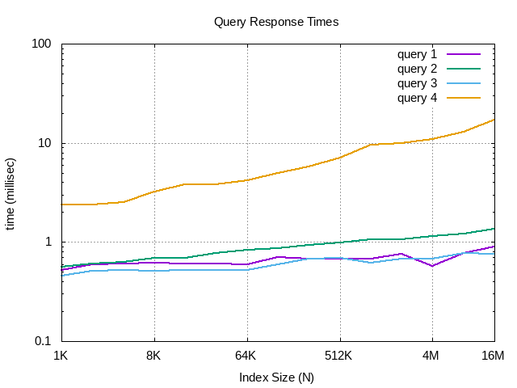

[](https://xscode.com/starkdg/reventis)

A Redis module for the indexing of point geospatial data in time and space.
Reventis introduces a native data type into the Redis ecosystem with commands
for the fast insertion, deletion and lookup of event points, as well as a
range query to retrieve all points within a rectangular region over a given
time period.  Reventis clients can delete all points in a given region or 
purge all points before a certain time. 

Events can be associated with categories - denoted as integers - for the
purpose of finding  only certain categories of events in range queries.

Reventis provides commands for object-tracking.  By associating an
object id number with added events, clients can group events in common.
Reventis clients can query for all objects in a given spatial area and
time period, or for all of an object's events.


## How It Works

Reventis uses the concept of a space-filling curve to assign events designated
by geospatial coordinates and a fixed time point a single sequence number.
Space-filling curves have the valuable property of helping to keep those points
that are proximal to one another in a multi-dimensional space, also close in
the linear sequence.  No curve ensures a perfect clustering of points, but the sequence
number enables the events to be stored in a linear balanced search tree - in this
case, a standard red-black tree - with all the benefits of fast efficient logarithmic
access complexity.   

Events can be traversed in order of the sequence number on the search tree.  Given a
rectangular search region and the current sequence number - starting with 0 - we can
always find the next sequence number that is also the next lowest in the region.
In this way, we can guide the search.  We know there is no more possible matches when
the current sequence number is not only out of the query region, but when we know there
are no greater sequence numbers that will snake back into the region.

Complexity is difficult to determine, because it is highly dependent on the number of
event points indexed in a query region.  If there are few or no points to be found, the
function returns very quickly, since the next sequence it finds on the tree traversal
is quickly identified as out of the region.  Performance is there dependent on the number
of indexed events within the query region. 


## Module Commands

Reventis implements the following commands to insert, delete, query and otherwise
interact with the index.  All mostly self-explanatory and discussed below.

```
reventis.insert key longitude latitude date-start time-start date-end time-end descr [id]
```

Insert an event as defined by longitude, latititude and time duration.  Dates and times
are denoted in the form MM-DD-YYYY HH:MM[:SS].  `descr` is a descriptive string for the
event and is inserted into the keyspace, `key:<id>` under the hashfield marked "descr".
An optional id integer can be provide. If not provided, one is assigned and returned by the
command.  User can store additional information for the event in the `key:<id>` keyspace by
making a new hashfield.  Complexity is O(log(N)), where N is is the number of indexed events.  

```
reventis.del key id
```

Delete id from the index of the specified keyspace.  Return simple string acknowledgement.
Complexity is O(log(N)), where N is the number of indexed events.

```
reventis.purge key date time
```

Delete all events on or before denoted datetime.  Return the number of deleted events.
Complexity is roughly on the order of O(Klog(N)), where K is the number of deleted events
and N is the total number of events indexed.  Performance varies widely with the number of
events it finds to delete.

```
reventis.delblk key x1 x2 y1 y2 datetime-start datetime-end [category...]
```

Delete a block of events indexed in a given range.  Range of longitude is x1 to x2.
Range of latitude is y1 to y2.  Datetime ranges are in the form MM-DD-YYYY HH:MM[:SS].
Apply a category filter by specifiying category integer values.  Returns the number of
deleted events.  Complexity varies widely but is roughly on the order of O(Klog(N)),
where K is the number of events found to delete, and N is the total number of indexed events. 

```
reventis.delkey key
```

Delete a key of the module's datatype.  Use encourage instead of `del key`, since it also
deletes all the key:id keyspaces containing the `descr` fields.  However, use `del` to
preserve the `descr` strings.  Complexity is on the order of O(N), where N is the number of
total events indexed.

```
reventis.lookup key id
```

Lookup event by id value. Returns an array composed of [descr, id, object_id, longitude,
latitude, datetime_start, datetime_end].  Complexity is on the order of O(1).

```
reventis.query key x1 x2 y1 y2 t1 t2 [cat ...]
```

Query the index for all the elements in a given range.  The longitude range is given by x1 to
x2. The latitude range is given by y1 to y2.  The timespan is given by t1 to t2, where both
are provided in the form MM-DD-YYYY HH:MM[:SS].  The command returns the results in the form
of an array of arrays.  Each inner array being [descr, id, longitude, latitude, time1, time2].
Complexity varies widely, but is roughly on the order of O(Klog(N)), where K is the number of
retrieved results, and N is the number of indexed events.


```
reventis.querybyradius key longitude latitude radius mi|km|ft|m date-start time-start date-end time-end [cat_id ...]
```

Query the index for all elements within a given radius.  Radius units are specified in the next
argument as either mi, km, ft or m. Returns the result as an array of arrays. Each inner array
composed of [descr, id, longitude, latitude, t1, t2].  Complexity same as query.

```
reventis.addcategory key event_id [cat ...]
reventis.remcategory key event_id [cat ...]
```

Associate/dissociate any number of category integers to specified event ids.
Categories can be from 1 to 64.  Complexity is O(1).

```
reventis.size key
reventis.depth key
```

Get the number of indexed events with the size command.  It returns an integer value.
Or get the depth of the tree datastructure with the depth command. It also returns an
integer value.  Both are O(1) complexity.

```
reventis.print key
```

Useful debugging command that prints the tree data structure to redis log file.  Only
use for small trees.


## Object Tracking Commands

By assigning an object id to events, events can be grouped together to provide some basic tracking
features. Call `reventis.update` to add new events with an object id.  This functions just like
insert but for the object id.  `reventis.queryobj` queries for objects within a certain
range and returns the relevant events.  `reventis.trackall` does the same thing except
returns a list of object ids falling within the query range.    

You can then retrieve the histories for a given object.  Supply optional date and time limits to
restrict the query to certain time limits.  An entire history of objects can be deleted with
`reventis.delobj`.  Quick and ready access to all objects is enabled by a directly mapped
data structure.  

```
reventis.update key longitude latitude date time  object_id descr [id]
```

Update an object with another event.  Date and time are provided in the form MM-DD-YYYY
and HH:MM[:SS].  The `descr` string is a descriptive string.  A unique event id will
be assigned by the module.  This is the normal expected use, but an id can be optionally provided.
Comlexity is on the order of O(log(N)), where N is the number of indexed events. 


```
reventis.queryobj key x1 x2 y1 y2 t1 t2
```

Query objects in a specified range.  This commands returns all events indexed as objects.
Complexity varies widely, but is roughly on the order O(Klog(N)), where K is the number
of retrieved objects and N is the number of indexed events.

```
reventis.trackall key x1 x2 y1 y2 t1 t2
```

Returns a list of object integer ids that fall in a given range.  Complexity varies widely,
but roughly on the order of O(klog(N));

```
reventis.hist key object_id [t1 t2]
```

Return all events for a given object - optionally over a given time period. Time period is
given by t1 to t2 in the form of MM-DD-YYYY HH:MM[:SS].  Results are returned in an array
of arrays.  Each inner array composed of
[descr, event_id, object_id, longitude, latitude, datetime].
Complexity is on the order of O(K), where K is the number of events for the object.

```
reventis.delobj key object_id
```

Delete an object with all its events.  Return the number of events deleted.
Complexity is O(K), where K is the number of events deleted.


## Client API

Client code is provided with reventisclient_util.cpp to interact with the module.  It is used
by the testreventis example program.  


## Utilities

The load events utility program is available to add new events.  


```
./loadevents key [events|objects|gen] [file|n] 

```

You must specify one of three options: "events", "objects" or "gen".  Both "events" and "objects"
must be followed by the name of a file containing the events and objects.  Examples can be found in
data.csv and objects.csv files.  Each row in data.csv contains a different event definition; each row
in objects.csv contains a different object definition.  Do not switch the two files.

The "gen" option is to randomly generate events and submit them to the redis server.  This must be
by an integer option, n for the number of events to randomly generate. 

The `testreventis` program will test the basic functions of the module. It will run with
ctest, but make sure you have a redis-server running before you invoke it.  


## Performance

A graph of query times for various number of indexed events. This is for four different standard
queries, each of different size.  Queries 1,2 and 3 stay well within 1ms or below.  Query 4 response
times explode, but it's literally the size of Texas. 




## GDELT Application

The Global Database of Events, Locations and Tones - GDELT - is a database of world-wide events. The
project - [gdelt](https://www.gdeltproject.org/) - curates information on events  from a variety of
sources across the web, including an estimate of its geospatial coordinates and a timestamp.  The project
has logged millions of events from 1979 to the present.  Each event is logged with several factors of
information.

The `loadgdelt` program can parse a raw .csv data files containing gdelt v2 events and submit them to
a redis server. It submits the events to the redis-server with a category based on its top-level CAMEO
event code. Invoke it like so:

```
./loadgdelt <key> <csv_event_file>
```

The `gdelt.sh` script will automatically download the files and run loadgdelt for each file.  Just adjust
the `content_regexp` variable to include the desired timespan.  One year submits rougly  20 million events and
consumes about 10GB of RAM memory.  Also, adjust key variable to reflect the value for the desired key to use
in the redis-server.  

Then you can do interesting queries on the data.  For example,

```
reventis.query <key> -72.723574 -72.641509 41.722626 41.809872 06-01-2016 00:00 07-01-2016 00:00
```

will get all events recorded in the Hartford, Ct area for the month of June in 2016.


```
reventis.query <key> -72.723574 -72.641509 41.722626 41.809872 06-01-2016 00:00 07-01-2016 00:00 14
```

will get all events in Hartford, CT area for month of June in 2016 recorded as "protest" events.


The assigned event codes in the data set are  not entirely accurate, and some events are added
multiple times for multiple event codes.  Also, the geospatial location data is only a rough estimate and
is probably accurate to only city or state resolution.  Nonetheless, you can get an idea for the stories
generated for a particular city/state at a particular moment in time.  To avoid an impossibly long list
of results, you can query using the event codes.  You can also reduce the query region to a smaller area
or time span. 

### CAMEO Event Codes

Here's a list of the top level cameo event codes used as categories. 

01 - make public statement
02 - appeal
03 - expression of interest to cooperate
04 - Consult
05 - diplomatic cooperation
06 - material cooperation
07 - provide aide
08 - yield
09 - investigate
10 - demand
11 - disapprove
12 - reject
13 - threat
14 - protest
15 - show force
16 - reduce relations
17 - coercion
18 - assault
19 - fight
20 - unconventional mass violence (e.g. guerrilla warfare)

## Installation Instructions

To build and install the module:   

```
make .
make all
make install
```

Run `make test` when you have a redis server up and running.  

Installs to /var/local/lib directory.

To load the module into redis, just type in the redis-cli:

```
module load /var/local/lib/reventis.so
module unload reventis
module list

```

Or, put this in your redis.conf configuration file:

```
loadmodule /var/local/lib/reventis.so
```

The latter option is preferable, since it is impossible to simply unload
the module once data is inserted into the database. 


